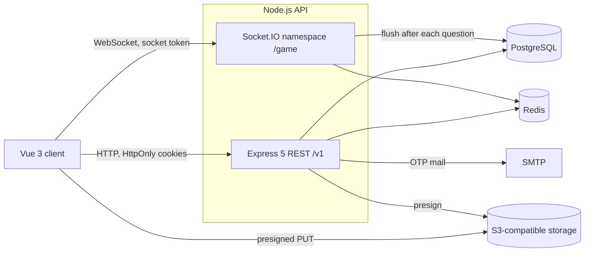

# MyQuizz

[](LICENSE)
[](https://nodejs.org)
[](https://www.typescriptlang.org)
[](https://vuejs.org)
[](https://socket.io)
[](https://docs.docker.com/compose/)
[](#contributing)

A real-time quiz platform: write a quiz, open a room, and let everybody answer together from their own screen while the scores update live.

One host drives the match, players join with a room code, and the server keeps the single source of truth for timing, grading and ranking.

**Live demo** — [myquizz.dpdns.org](http://myquizz.dpdns.org) · API at [api.myquizz.dpdns.org](http://api.myquizz.dpdns.org) · API reference at [api.myquizz.dpdns.org/v1/docs](http://api.myquizz.dpdns.org/v1/docs)

You can try it without signing up: open the client, enter a room code and a nickname, and you are in as a guest.

---

## Table of contents

- [What it does](#what-it-does)
- [Repository layout](#repository-layout)
- [Tech stack](#tech-stack)
- [Architecture](#architecture)
- [How a match runs](#how-a-match-runs)
- [Quick start with Docker](#quick-start-with-docker)
- [Manual setup](#manual-setup)
- [Demo data](#demo-data)
- [Deployment](#deployment)
- [Troubleshooting](#troubleshooting)
- [Contributing](#contributing)
- [License](#license)

---

## What it does

- **Author quizzes** — multiple choice, multiple select and short answer questions, with images and per-question time limits.
- **Discover** — a home screen built from featured, trending and newest sections, plus an endless discovery feed and full-text search.
- **Play live** — lobby with a room code, countdown, synchronized questions, answer distribution and a leaderboard between questions.
- **Several game modes** — classic host-paced matches, plus solo, survival, marathon and practice at each player's own rhythm.
- **Accounts** — email and password or Google sign-in, profile, avatar, password reset by email.
- **Guests welcome** — a player can join a room with just a nickname, no account needed.

## Repository layout

| Package | Description | Docs |
| --- | --- | --- |
| [`backend/`](backend) | REST API, realtime gameplay, database and jobs | [Backend README](backend/README.md) |
| [`frontend/`](frontend) | Web client | [Frontend README](frontend/README.md) |

## Tech stack

**Backend** — Node.js, TypeScript, Express 5, Socket.IO, PostgreSQL, Redis, Zod, JWT, S3-compatible object storage, OpenAPI reference served by Scalar.

**Frontend** — Vue 3, Vite, Pinia, TanStack Query, Tailwind CSS.

## Architecture



One process serves both the REST API and the WebSocket namespace, so a match never has to coordinate across nodes. **PostgreSQL is the source of truth**; **Redis holds the state of matches that are currently running** and is flushed back to Postgres after every question. Losing Redis costs the live match, never the history.

Both layers of the API follow the same chain inside the backend: route → controller → service → repository.

## How a match runs

1. The host creates a session from one of their quizzes. The server **snapshots** the questions, so editing the quiz afterwards cannot change a match already in flight.
2. Players join with the 6-character room code, as a signed-in user or as a guest with a nickname. Each one receives a short-lived **socket token**.
3. Everybody connects to the `/game` namespace with that token and lands in the lobby room.
4. The host starts the match: countdown, then the same question is pushed to everyone at the same moment. The **correct answer is stripped** from what players receive.
5. Players submit an answer. The server grades it, applies the speed bonus, and refuses a second answer for the same question.
6. When the timer runs out or everyone has answered, the question locks and the results and leaderboard go out. Scores are flushed to Postgres.
7. Repeat until the last question, then the final leaderboard and the review screen.

A player who reloads or loses connection reconnects and receives a snapshot of the current question with the time that is actually left.

## Quick start with Docker

The fastest way to get the whole stack up: PostgreSQL, Redis, the API and the client, all from one command. You only need Docker with Compose.

```bash
git clone https://github.com/Ntd1411/myquizz.git
cd myquizz

cp .env.example .env     # the root .env is the Docker configuration
docker compose up -d --build
```

| Service | URL |
| --- | --- |
| Client | http://localhost:5173 |
| API | http://localhost:3000/v1 |
| API reference | http://localhost:3000/v1/docs |
| Health check | http://localhost:3000/health |
| PostgreSQL | localhost:5432 |
| Redis | localhost:6379 |

The root `.env.example` is written for Compose, so `DB_HOST=postgres` and `REDIS_HOST=redis` already point at the service names on the internal network — leave them as they are. The values you do want to change are the secrets (`JWT_SECRET`, `JWT_REFRESH_SECRET`, `SOCKET_JWT_SECRET`, `REDIS_PASSWORD`) and, if you need uploads, mail or Google sign-in, the `SPACES_*`, `SMTP_*` and `GOOGLE_*` blocks. Everything else works out of the box.

Database migrations run automatically when the API container starts. Postgres and Redis data live in named volumes, so they survive a restart.

```bash
docker compose logs -f backend   # follow the API logs
docker compose down              # stop everything
docker compose down -v           # stop and wipe the database
```

## Manual setup

Use this when you want hot reload while developing. You need Node.js 20+, plus a PostgreSQL and a Redis instance you can reach.

```bash
git clone https://github.com/Ntd1411/myquizz.git
cd myquizz

# API
cd backend
cp .env.example .env     # fill in database, Redis and secrets
pnpm install
pnpm dev                 # http://localhost:3000

# Client, in another terminal
cd ../frontend
cp .env.example .env
pnpm install
pnpm dev                 # http://localhost:5173
```

Each package has its own `.env.example` here — the root one is only for Docker. Point `DB_HOST` and `REDIS_HOST` at `localhost` (or wherever your services run) instead of the Compose service names.

Migrations still run on boot, and the API reference is available at `http://localhost:3000/v1/docs`. Each package README documents the full environment variables, scripts and architecture.

## Demo data

A fresh database is empty, which makes the home page and the discovery feed look broken. Seed it:

```bash
cd backend
pnpm db:seed:demo   # users, quizzes and 90 days of play history
pnpm db:score       # compute the ranking used by home and feed
```

The seed is deterministic, so two runs produce the same database. It creates a handful of accounts that all share the password `Password123!`:

| Account | Role |
| --- | --- |
| `admin@myquizz.dev` | admin |
| `mod@myquizz.dev` | moderator |
| `dung@example.com` | regular user with public quizzes |

The rest are ordinary authors, plus a few deliberate edge cases: private quizzes, a quiz with no questions and a soft-deleted account, all of which must stay out of the public feed.

> These credentials belong to your local seed only. Do not seed them into a public deployment.

## Deployment

### Containers

Both images are multi-stage and ship only what they need to run.

- **Backend** — builds on `node:22-alpine`, compiles TypeScript, then installs production dependencies only. Migrations run from `dist/`, never through `tsx`, because the runtime image has no dev toolchain. `bcrypt` is compiled from source since it has no musl prebuild.
- **Frontend** — builds with Vite, then serves the static output from `nginx:1.27-alpine` on port 5173. The nginx config falls back to `index.html` so Vue Router history mode survives a refresh, and caches the hashed `/assets` files for a year.

### VPS with PM2

The live demo runs from a plain VPS. [`deploy.sh`](deploy.sh) is the single entry point, executed on the server:

```bash
bash /var/www/myquizz/deploy.sh
```

It fetches `origin/main` and **hard-resets** the working tree (the server checkout is disposable, local edits are discarded), builds the backend and the frontend *before* touching production, runs `db:migrate:prod` then `db:score:prod`, reloads the API through PM2, and finally publishes the frontend build to the web root with `rsync`.

The API itself is managed by PM2 through [`ecosystem.config.cjs`](ecosystem.config.cjs): a single fork-mode process named `myquizz-api`, restarted above 600 MB, with a 10-second minimum uptime so a crash loop shows up as `errored` instead of hiding behind `online`. Logs land in `/var/log/myquizz/`.

```bash
pm2 logs myquizz-api
pm2 restart myquizz-api --update-env
```

### What changes in production

- `NODE_ENV=production`, and `API_PUBLIC_URL` set to the public API origin so the reference page offers the production server instead of localhost.
- `FRONTEND_URL` and `ALLOW_ORIGIN` must list the real domains. The API and the client sit on different subdomains, so the auth cookies are cross-site and the origins have to match exactly.
- The reverse proxy in front of the API has to forward the `Upgrade` and `Connection` headers, otherwise the WebSocket handshake silently falls back to polling.
- `GOOGLE_CALLBACK_URL` must be the production URL and registered in the Google console.

## Troubleshooting

| Symptom | Cause and fix |
| --- | --- |
| `docker compose up` fails on a port | 3000, 5173, 5432 or 6379 is already taken by a local service. Stop it, or change the left-hand side of the port mapping in `docker-compose.yml`. |
| API container restarts in a loop | Almost always the database. Check `docker compose logs backend`; `/health` returns 503 when Postgres is unreachable. |
| `Redis connection failed, continuing without cache` | The API boots without Redis on purpose, but live matches need it. Check that `REDIS_PASSWORD` in `.env` is the same one Compose passes to `redis-server --requirepass`. |
| Home page and feed are empty | Expected on a fresh database. Run `pnpm db:seed:demo` then `pnpm db:score`. |
| Logged in, but every request answers 401 | The cookies are not being sent. The client must call the API with credentials, and the API origin must be listed in `ALLOW_ORIGIN`. In production both sides need HTTPS for a cross-site cookie to be accepted. |
| Socket connects then immediately disconnects | The socket token is missing, expired or issued for another session. Get a fresh one from the join or host-token endpoint; the lifetime is `SOCKET_TOKEN_TTL`. |
| Google sign-in returns `redirect_uri_mismatch` | `GOOGLE_CALLBACK_URL` and the URI registered in the Google console are not identical, down to the scheme and the trailing path. |
| Image upload fails after the presign call | The browser uploads straight to object storage, so the bucket needs a CORS rule allowing `PUT` from your client origin. |
| Database is gone after a restart | You ran `docker compose down -v`, which deletes the named volumes. Plain `down` keeps them. |

## Contributing

Issues and pull requests are welcome.

1. Fork the repository and create a branch from `main`, named after what it does: `feat/...`, `fix/...`, `refactor/...`, `docs/...`.
2. Keep the existing style: ESLint with no semicolons, single quotes, two-space indentation. Comments, logs and UI strings are written in English.
3. Follow the layering already in place — on the API side that means route → controller → service → repository.
4. Before opening the pull request, make sure the package you touched still passes:
   ```bash
   npx tsc --noEmit
   pnpm lint
   ```
5. Write commits in the [Conventional Commits](https://www.conventionalcommits.org/) style, for example `feat(quiz): add category filter to search`.
6. In the pull request, describe what changed and how you verified it. If you changed an endpoint, update the OpenAPI document in `backend/src/docs/` in the same pull request.

## License

Released under the [MIT License](LICENSE).
