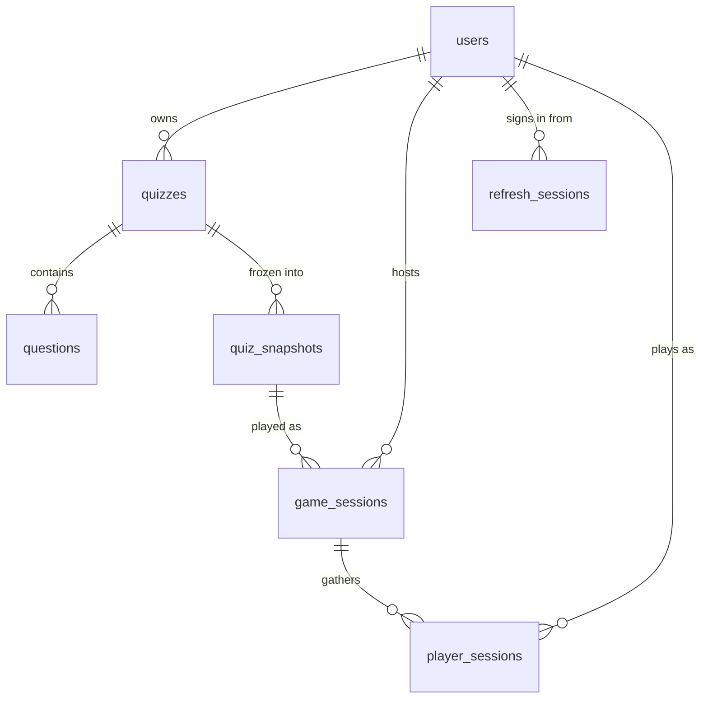

# MyQuizz — Backend

[](https://nodejs.org)
[](https://www.typescriptlang.org)
[](https://expressjs.com)
[](https://socket.io)
[](https://www.postgresql.org)
[](https://redis.io)
[](https://api.myquizz.dpdns.org/v1/docs)
[](https://api.myquizz.dpdns.org/v1/docs/socket)
[](../LICENSE)

Real-time quiz backend: accounts, quiz authoring, discovery feeds, live game sessions and image uploads.

Node.js + TypeScript (ESM), Express 5 for the REST API, Socket.IO for the gameplay, PostgreSQL as the source of truth and Redis as the hot layer for running matches.

Live at [api.myquizz.dpdns.org](https://api.myquizz.dpdns.org), with two references: the REST one at [/v1/docs](https://api.myquizz.dpdns.org/v1/docs) and the realtime one, covering every Socket.IO event, at [/v1/docs/socket](https://api.myquizz.dpdns.org/v1/docs/socket). The raw documents are at [/v1/docs/openapi.json](https://api.myquizz.dpdns.org/v1/docs/openapi.json) and [/v1/docs/socket/asyncapi.json](https://api.myquizz.dpdns.org/v1/docs/socket/asyncapi.json). The client it serves is [myquizz.dpdns.org](https://myquizz.dpdns.org).

> Part of the [MyQuizz](../README.md) monorepo. The client lives in [`frontend/`](../frontend/README.md). To run the whole stack with Docker in one command, see the [root README](../README.md#quick-start-with-docker).

---

## Table of contents

- [Stack](#stack)
- [Getting started](#getting-started)
- [Environment](#environment)
- [Scripts](#scripts)
- [Project structure](#project-structure)
- [REST API](#rest-api)
- [Authentication](#authentication)
- [Errors and status codes](#errors-and-status-codes)
- [Realtime API](#realtime-api)
- [Game engine](#game-engine)
- [Database](#database)
- [Data and caching](#data-and-caching)
- [Ranking](#ranking)
- [Rate limiting and security](#rate-limiting-and-security)
- [Conventions](#conventions)

---

## Stack

| Concern | Choice |
| --- | --- |
| Runtime | Node.js, TypeScript in ESM (`"type": "module"`) |
| HTTP | Express 5 |
| Realtime | Socket.IO 4, namespace `/game` |
| Database | PostgreSQL via `pg` |
| Cache / live state | Redis via `ioredis` |
| Validation | Zod |
| Auth | JWT in HttpOnly cookies, bcrypt, Google OAuth 2.0 + One Tap |
| Storage | S3-compatible object storage (DigitalOcean Spaces) with presigned uploads |
| Mail | Nodemailer (SMTP) |
| API reference | OpenAPI 3.0.3 rendered by Scalar |

## Getting started

Requires Node.js 20+, a PostgreSQL instance and a Redis instance.

```bash
cd backend
pnpm install            # or npm install
cp .env.example .env    # then fill in the values
pnpm dev
```

The server starts on `PORT` (3000 by default) and prints `App listening on port 3000`.

- API root: `http://localhost:3000/v1`
- API reference (read-only): `http://localhost:3000/v1/docs`
- API reference with Test Request: `http://localhost:3000/v1/api-docs`
- Realtime reference (Socket.IO events): `http://localhost:3000/v1/docs/socket`
- Health check: `http://localhost:3000/health` → `{ "db": true, "redis": true }`, answers 503 when Postgres is unreachable

Migrations run automatically at boot, so a fresh database is usable straight away. Redis is treated as a cache, not a hard dependency: if it is unreachable the server logs the failure and keeps booting, but live matches need it.

## Environment

Every variable from `.env.example`, grouped by concern.

| Group | Variables |
| --- | --- |
| Database | `DB_HOST`, `DB_PORT`, `DB_USER`, `DB_PASSWORD`, `DB_NAME`, `DB_POOL_MAX`, `DB_IDLE_TIMEOUT`, `DB_CONNECTION_TIMEOUT` |
| Redis | `REDIS_HOST`, `REDIS_PORT`, `REDIS_PASSWORD` |
| Auth | `JWT_SECRET`, `JWT_EXPIRES_IN`, `JWT_REFRESH_SECRET`, `JWT_REFRESH_EXPIRES_IN` |
| Socket auth | `SOCKET_JWT_SECRET`, `SOCKET_TOKEN_TTL` |
| Server / CORS | `PORT`, `NODE_ENV`, `FRONTEND_URL`, `ALLOW_ORIGIN` (comma separated) |
| API reference | `API_PUBLIC_URL` — optional, public origin of this API including the `/v1` prefix. When set it is listed first as the production server in `/v1/docs`; left empty the reference only offers `localhost`. |
| Object storage | `SPACES_ACCESS_KEY`, `SPACES_SECRET_KEY`, `SPACES_ENDPOINT`, `SPACES_BUCKET`, `SPACES_REGION`, `SPACES_PUBLIC_URL` |
| Mail | `SMTP_HOST`, `SMTP_PORT`, `SMTP_USER`, `SMTP_PASSWORD`, `MAIL_FROM` |
| Google OAuth | `GOOGLE_CLIENT_ID`, `GOOGLE_CLIENT_SECRET`, `GOOGLE_CALLBACK_URL` |
| Jobs | `SCORING_INTERVAL_MINUTES` (0 disables the scoring job) |

The access and refresh tokens use separate secrets, and the socket token uses a third one: a leaked socket token must never be usable against the REST API.

## Scripts

| Script | What it does |
| --- | --- |
| `dev` | `tsx watch src/app.ts` |
| `build` | `tsc` then copies the `.sql` files into `dist/` |
| `start` | Runs the compiled `dist/app.js` |
| `lint` / `lint:fix` | ESLint over the whole package |
| `docs:export` | Writes the OpenAPI document to `docs/openapi.json` |
| `db:migrate` | Applies `schema/` then `migrations/` |
| `db:seed` | Seeds the base data |
| `db:seed:demo` | Seeds a demo dataset (users, quizzes, questions) |
| `db:score` | Recomputes the quiz ranking scores once |
| `db:migrate:prod`, `db:score:prod` | Same, against the compiled build |

## Project structure

```
src/
  app.ts                 Boot: engine, migrations, Redis, Express, Socket.IO, jobs
  docs/                  OpenAPI and AsyncAPI documents, and the two references (see below)
  infrastructure/
    cache/               Redis client and cache helpers
    config/              Env parsing, Google OAuth, object storage
    database/            Pool, migration runner, schema/, migrations/, seeds
    jobs/                Quiz scoring job and its CLI
    mail/                SMTP transport
  modules/
    auth/                Sessions, cookies, token rotation, Google sign-in
    user/                Profile, password flows, avatar
    quiz/                Authoring, listings, home sections, discovery feed
    game/                Sessions, config, realtime gameplay, engine/
    storage/             Presigned upload URLs
    admin/               Account moderation: list, ban, lift a ban
  shared/
    errors/              AppError
    middlewares/         Error handler, optional auth, rate limits
    utils/               Response envelope, cookies
    validators/          Zod request validation
```

Each module follows the same chain: **route → controller → service → repository**. Routes only wire middleware, controllers only read the request and shape the response, services hold the rules, repositories own the SQL.

## REST API

Everything is mounted under `/v1` and rate limited. Full, always-up-to-date reference at **`/v1/docs`**, raw document at `/v1/docs/openapi.json`. The Socket.IO layer has its own reference at **`/v1/docs/socket`** (raw document at `/v1/docs/socket/asyncapi.json`), because OpenAPI cannot describe an event stream.

The same document is published twice, from `src/docs/serve.ts`:

| Route | Test Request | Meant for |
| --- | --- | --- |
| `/v1/docs` | hidden | Public reading. Nobody can fire a live call at the API from the page. |
| `/v1/api-docs` | kept | Internal use. The reverse proxy puts HTTP basic auth in front of it, so it is not reachable from outside. |

Each one serves its own copy of the document (`/v1/docs/openapi.json` and `/v1/api-docs/openapi.json`), so the internal page never depends on a path the proxy may restrict. **Restricting `/v1/api-docs` is the proxy's job** — the application itself does not authenticate it.

A third page, from `src/docs/serve.socket.ts`, covers the gameplay events: **`/v1/docs/socket`**, raw AsyncAPI document at `/v1/docs/socket/asyncapi.json`. It is mounted before `/v1/docs` because the reference UI answers every path under it. Live: [/v1/docs](https://api.myquizz.dpdns.org/v1/docs), [/v1/docs/socket](https://api.myquizz.dpdns.org/v1/docs/socket).

### Response envelope

Every response, success or failure, has the same shape:

```json
{
  "success": true,
  "data": { },
  "error": null,
  "meta": { "timestamp": "2026-08-12T03:00:00.000Z" }
}
```

On failure `data` is `null` and `error` carries **a code and nothing else**:

```json
{
  "success": false,
  "data": null,
  "error": { "code": "GAME_ROOM_NOT_FOUND" },
  "meta": { "timestamp": "2026-08-12T03:00:00.000Z" }
}
```

No message and no field dump: prose written here would be English, would end up on a screen that has to speak another language, and would leak internals. The reason is logged instead, and the client owns the wording. Paginated endpoints add `meta.pagination`, cached ones add `meta.cached`.

### Endpoint groups

| Prefix | Operations | Covers |
| --- | --- | --- |
| `/v1/auth` | 7 | Register, login, refresh, logout, Google OAuth redirect flow and One Tap |
| `/v1/users` | 9 | Own profile (the email is immutable), public profile, password change, avatar, forgot / reset password |
| `/v1/quizzes` | 9 | Authoring, search, own quizzes, an author's quizzes, home sections, discovery feed |
| `/v1/games` | 12 | Game modes, play history, create a session, lobby, config patch, host token, join, leaderboard, results, personal answer review, closed-match summary and answer sheet |
| `/v1/storage` | 1 | Presigned upload URL |
| `/v1/admin` | 3 | Account moderation, admin role only: list accounts with a status filter, ban an account, lift a ban |

Listings are keyset paginated: pass back `meta.pagination.nextCursor`, and ask for `include_total=true` only when the count is actually needed. The cursor encodes the query, filters and sort, so changing any of them mid-pagination is rejected instead of silently returning rows from another result set.

`GET /v1/admin/users` is the exception: it pages by `offset` and `limit` and always answers with a `total`, because a moderation table has to jump to an arbitrary page and say how many accounts match. Its `total` is counted with the same `status` filter the listing applied, so the pager is never told about pages the listing will not produce.

Every read goes through one mapper per shape: `toQuizSummary` for a listing row, `toQuizDetail` for `GET /v1/quizzes/id/:quizId`. The detail response therefore carries the same nested `owner` block (`id`, `fullname`, `avatar`) and the same `question_count` / `play_count` counters as a card, plus its questions ordered by `id`; `hot_score` and `scored_at` stay internal. `POST /v1/quizzes` and `PATCH /v1/quizzes/id/:quizId` re-read the quiz through that same mapper before answering, so a metadata-only patch never comes back with an empty question list.

### Play history

Three endpoints read matches that are already over, where `game_sessions.session_status` is `finished` or `cancelled`:

| Endpoint | Answers with |
| --- | --- |
| `GET /v1/games/history` | The reader's own closed rooms. `role=played` or `role=hosted`, `limit` 1..50 (20 by default), optional `include_total` |
| `GET /v1/games/{id}/summary` | One match: session, the quiz as it was played, standings, per-question accuracy, and `viewer` (`isHost`, `playerId`) |
| `GET /v1/games/{id}/my-answers` | The reader's own answer sheet for that match |

Three properties are worth knowing:

- **A guest has a history too.** Identity comes from the session cookie when there is one, and otherwise from the `x-guest-id` header the client already carries, which is how a `player_sessions` row without `player_id` is matched. A reader with neither is refused with `GAME_AUTH_REQUIRED`.
- **Ordering is `coalesce(finished_at, created_at) desc, id desc`.** A room cancelled before it ever ended has no `finished_at`, and sorting on the raw column would bury it. The cursor is an opaque base64url string (`v1|role|endedAt|id`) validated against the role it was issued for, so paging one list with the other list's cursor is rejected as `GAME_CURSOR_INVALID` instead of returning rows from another result set. The same ordering expression is duplicated in `011_game_history_indexes.sql` and must stay identical.
- **The quiz name and cover come from the snapshot**, never from `quizzes`, so a quiz renamed or rewritten after the match still shows the title it was actually played under. A quiz that is *deleted* is a different case: the delete is hard and cascades, so it takes its snapshots and the matches hosted from them with it, and those matches stop appearing in anybody's history.

A summary is readable by the host and by everyone who held a seat (`GAME_FORBIDDEN` for anyone else); the answer sheet needs a seat, so a host asking for it gets `GAME_PLAYER_ONLY`. A match still running answers `409 GAME_STILL_RUNNING`, and a deleted one `410 GONE`.

### Account moderation

`/v1/admin` is the only module gated by role. `authMiddleware` establishes who is calling, and the role check itself sits in the controller rather than in the router, so a handler added without its own check cannot ship reachable by a normal account.

| Endpoint | Does |
| --- | --- |
| `GET /v1/admin/users` | Lists accounts newest first. `offset`, `limit` 1..100 (20 by default), `status=all` \| `active` \| `banned` |
| `DELETE /v1/admin/users/{id}` | Bans the account: stamps `deleted_at` |
| `POST /v1/admin/users/{id}/restore` | Lifts the ban: clears `deleted_at` |

- **A ban is the soft delete the rest of the API already respects.** Every user lookup filters on `deleted_at IS NULL`, so a banned person can no longer sign in while their quizzes and match history stay where they are. Nothing is erased, which is what makes the undo a one-line update rather than a restore procedure.
- **Both writes are idempotent.** Neither is conditional on the current `deleted_at`, so banning an already banned account succeeds and a `rowCount` of zero can only mean the id does not exist. A double click or a retried request therefore cannot turn into a `404` that reads as "this account is gone".
- **An admin cannot ban their own account**, answered as `400 ADMIN_CANNOT_BAN_SELF`. On a workspace with a single admin that call would remove both the session and the role needed to lift the ban. The screen omits the control, but the rule has to hold server side because a request can be made without the screen.
- **The listing returns `deleted_at`.** With `status=all` both kinds of row come back, and that column is the only thing telling them apart.
- **Ordering is `created_at desc, id desc`.** Offset paging over an unordered select is free to show one account on two pages and never show another; the id breaks ties between accounts created in the same instant.

## Authentication

Sign-in sets two HttpOnly cookies; there is no `Authorization` header to manage. A browser client only has to send credentials with the request, and the API does the rest.

### The three tokens

| Token | Where it lives | Secret | Lifetime |
| --- | --- | --- | --- |
| `accessToken` | HttpOnly cookie, sent automatically | `JWT_SECRET` | `JWT_EXPIRES_IN` |
| `refreshToken` | HttpOnly cookie, stored **hashed** in `refresh_sessions` | `JWT_REFRESH_SECRET` | `JWT_REFRESH_EXPIRES_IN` |
| socket token | Returned in a response body, passed in the Socket.IO handshake | `SOCKET_JWT_SECRET` | `SOCKET_TOKEN_TTL` |

Cookies are `httpOnly`, `sameSite=lax`, and `secure` only in production. The client and the API are meant to sit on sibling subdomains, where `lax` is enough and safer than `none`.

The socket token is deliberately not a cookie and uses its own secret: it is scoped to one game session and one role, so leaking it cannot grant access to the REST API.

### Refresh rotation

`POST /v1/auth/refresh` issues a brand new pair every time and invalidates the one it consumed. Only the SHA hash of a refresh token ever reaches the database, so a dump of `refresh_sessions` cannot be replayed.

1. Verify the JWT signature and that it is a refresh token.
2. Load the user; a missing or deactivated account stops here.
3. Look up the hashed token in `refresh_sessions`.
4. **Not found?** The token was valid but has already been rotated or revoked — that is a replay. Every session of that user is revoked and the call answers 401.
5. Otherwise revoke that row, mint a new pair, and store the new hash under the same device and IP.

So a stolen refresh token buys at most one round trip: as soon as either the attacker or the legitimate user rotates, the other one triggers the reuse detection and both are logged out everywhere.

`POST /v1/auth/logout` revokes the refresh row and adds the access token to `blacklist_token`, so the remaining minutes of its lifetime are dead too. A logout where the two cookies disagree about the user is treated like a replay and revokes every session.

### Google sign-in

Two flows share the same profile verification:

- **Redirect** — `GET /v1/auth/google` sends the user to the consent screen with an anti-CSRF `state` kept in a short-lived cookie, and `GET /v1/auth/google/callback` reads it back.
- **One Tap** — `POST /v1/auth/google/one-tap` verifies the `id_token` directly, with `GOOGLE_CLIENT_ID` as the expected audience.

Both end in the same place: an account matched by Google id, and the usual cookie pair.

**The profile email is immutable**, and `PATCH /v1/users/me` refuses an `email` field for that reason. The Google id is only the first lookup: when no row carries it — a link that was never persisted, a row restored from a seed — the flow falls back to matching by email. An address edited in the app no longer equals the one Google sends, so that fallback finds nothing and mints a second account for the same person. Freezing the address removes the whole class of drift; changing it later needs a deliberate flow that re-verifies the new address and keeps `google_id` attached to the same row.

## Errors and status codes

Errors are thrown, never returned. Services throw `AppError(statusCode, message, code?)`: the message is developer prose that goes to the log, the code is the only part the client ever sees. A single error handler turns anything that reaches it into the standard envelope, and fills in a fallback code from the status when nobody picked one, so a response is never left with nothing to match on.

| Source | Result |
| --- | --- |
| `AppError` with a code | Its own status and that code |
| `AppError` without one | Its own status and the fallback from `STATUS_FALLBACK_CODES` |
| Zod validation | `400` `VALIDATION_ERROR` |
| Upload too large | `413` `FILE_TOO_LARGE` |
| Unsupported file type | `400` `FILE_TYPE_UNSUPPORTED` |
| `ECONNREFUSED` / `ETIMEDOUT` | `503` `SERVICE_UNAVAILABLE` |
| Anything else | `500` `SERVER_ERROR`, logged with the stack, never leaked to the client |

What the status codes mean here:

| Code | Used for |
| --- | --- |
| `400` | Validation failure, malformed id, nothing to update |
| `401` | Missing, blacklisted or invalid token, wrong credentials |
| `403` | Authenticated but not allowed: deactivated account, not the host of the session |
| `404` | The resource does not exist, or is not visible to the caller |
| `409` | Conflict with the current state: email already registered, config patch outside the lobby |
| `410` | The resource existed but was soft deleted |
| `429` | Rate limited, with `Retry-After` telling you how long to wait |
| `503` | A dependency is down; `/health` reports the same |

The whole vocabulary lives in one place, `shared/errors/codes.ts`, and the reference at `/v1/docs` lists the exact codes each endpoint can return. Three rules govern it: name the situation and not the sentence (`GAME_ROOM_FULL`, never `ROOM_IS_FULL_ERROR`); add a code only when a caller could reasonably react differently, so two failures that lead to the same screen share one; and never rename or remove a shipped code, because clients match on it.

## Realtime API

Gameplay runs on Socket.IO, namespace **`/game`**. REST creates and configures a room; once the match starts, everything goes through the socket.

### Handshake

The socket token is not a cookie. Get it from REST first, then pass it in the handshake:

- host: `POST /v1/games/{id}/host-token` → `data.hostToken.socketToken`
- player: `POST /v1/games/{code}/join` → `data.socketToken`

```js
const socket = io('http://localhost:3000/game', { auth: { token: socketToken } })
```

The token carries the session, the role and the player row id. Identity is always read from the token, never from an event payload, so a client cannot answer or host on behalf of somebody else. A token for a finished or cancelled session is refused at the handshake.

Each connection joins `game:{code}`, and hosts additionally join `game:{code}:host`. Anything that would reveal an answer is sent to the host room only.

The tables below are a summary. Every payload, every acknowledgement and every rule is described in the realtime reference at **`/v1/docs/socket`**, generated from `src/docs/asyncapi.ts` (raw AsyncAPI document at `/v1/docs/socket/asyncapi.json`).

### Events sent by the client

| Event | Role | Purpose |
| --- | --- | --- |
| `lobby:join` | both | Enter the room and receive the current state |
| `lobby:leave` | both | Leave; a player is marked disconnected, not removed |
| `lobby:config-update` | host | Patch the game config while still in the lobby |
| `game:start` | host | Start the countdown, then the first question |
| `game:next` | host | Advance manually when `autoAdvance` is off |
| `game:pause` / `game:resume` | host | Freeze and restore every clock |
| `game:end` | host | End the match early |
| `question:answer` | player | Submit an answer, acknowledged by the server |
| `question:next` | player | Move on in self-paced modes when `autoAdvance` is off |
| `player:sync` | both | Ask for a full state snapshot after a reconnect |

### Events sent by the server

| Event | Audience | Meaning |
| --- | --- | --- |
| `lobby:updated` | room | Roster, status and config |
| `game:started`, `game:countdown` | room | The match is starting |
| `question:started` | room / player | The current question, without the correct answer |
| `answer:received` | room | How many answers arrived, never who was right |
| `question:locked` | room | Question closed, by timeout or because everybody answered |
| `question:results` | room | Correct answer and distribution, once locked |
| `question:timeout`, `question:awaiting_next` | player | Self-paced flow |
| `leaderboard:updated` | room | Rank, name and score |
| `player:eliminated`, `player:finished` | room / player | Per-player outcome |
| `game:state` | both | Full snapshot, used to restore a client after a reconnect |
| `game:ended` | room | Final standings and per-question stats |
| `host:question`, `host:answer-received`, `host:player-progress`, `leaderboard:host` | host room | Answer key and the full monitoring table |
| `error` | caller | A handler failed and no acknowledgement was expected |

### Rules that matter

- **The server is authoritative.** Grading, timing and scoring happen server side; `correct_answer` is stripped from every payload that leaves the server, except inside the host room and after a question is locked.
- **One answer per question.** The slot is claimed atomically in Redis, so two sockets racing on the same question cannot both be accepted.
- **Reconnects are cheap.** `lobby:join` or `player:sync` returns a full snapshot with the remaining time; a self-paced player gets back the leftover time, not a fresh timer.
- **The answer review is not a socket event.** It is `GET /games/:id/review`, authenticated by the socket token: the payload is a one-off document carrying every question with its answer key, and REST still answers once the room is `finished`, which the socket handshake refuses.

## Game engine

Modes live in `modules/game/engine/modes/` behind a small interface (`evaluateAnswer`, `shouldAdvance`, `isGameOver`), registered at boot by `bootstrapEngine()`.

| Mode | Pacing | Shape |
| --- | --- | --- |
| `classic` | host | Everybody answers the same question at the same time |
| `solo` | self | One player, own rhythm |
| `survival` | self | Limited lives, elimination |
| `marathon` | self | Loops the question bank until the match budget runs out |
| `practice` | self | No pressure, no deadline |

A mode also declares which config fields a host may change. Anything it locks is reported back under `ignored` instead of failing the whole request, so an outdated client never blocks a session from starting. `GET /v1/games/game-modes` returns the defaults and those rules.

## Database

### Tables

| Table | Holds |
| --- | --- |
| `users` | Accounts, `role` in admin / moderator / user, soft deleted through `deleted_at` |
| `quizzes` | Quiz metadata, owner, language, category, `is_public`, plus the ranking columns |
| `questions` | Questions of a quiz: type, text, image, `time_limit`, optional `question_hint` and `explanation`, `answer_options` and `correct_answer` as JSONB |
| `quiz_snapshots` | A frozen copy of a quiz taken when a session is created |
| `game_sessions` | One match: snapshot, code, host, mode, `config`, status, current phase and deadline, plus `finished_at` and `deleted_at` |
| `player_sessions` | One participant of one match: score, answered questions, streak, lives, status |
| `refresh_sessions` | Live refresh tokens, stored hashed, with device and IP |
| `blacklist_token` | Access tokens revoked before their natural expiry |
| `schema_migrations` | Which SQL files have already been applied |



A session points at a **snapshot**, never at the live quiz, so *editing* a quiz cannot rewrite a match that already happened. *Deleting* one is not so contained: `quiz_snapshots.quiz_id` references `quizzes` with `on delete cascade`, so removing a quiz row removes its snapshots, the `game_sessions` built on those snapshots, and the `player_sessions` seated in those games. A `player_sessions` row without `player_id` is a guest, identified by `player_guest_id` and a display name.

Deletion is soft almost everywhere: rows carry `deleted_at` and stay queryable, which is why a removed resource answers `410` rather than `404`.

**`DELETE /v1/quizzes/id/:quizId` is the exception: it is a hard delete.** The row is removed with `DELETE FROM quizzes`, not flagged, and the foreign keys do the rest in one cascade:

```
quizzes
  -> questions           (quiz_id, on delete cascade)
  -> quiz_snapshots      (quiz_id, on delete cascade)
       -> game_sessions       (quiz_snapshot_id, on delete cascade)
            -> player_sessions     (game_session_id, on delete cascade)
  -> player_sessions     (quiz_id, on delete cascade)
```

So deleting a quiz also erases the play history of every match ever hosted from it, for every player who took part, and there is no undo. The endpoint still returns the deleted row, but only so the client can say what it removed. Rows soft deleted by the earlier version of the endpoint are left alone and keep answering `404`.

### Migrations

Two folders, applied in this order at boot and by `pnpm db:migrate`:

- `schema/` — the base tables, `001_users.sql` through `006_player_sessions.sql`.
- `migrations/` — incremental changes, `001_refresh_sessions.sql` through `011_game_history_indexes.sql`: refresh sessions, token blacklist, question hints, Google OAuth columns, quiz ranking, home sections and rails, listing indexes, player avatar columns, and the play-history indexes.

Every file that runs is recorded in `schema_migrations` **by filename**, so each one is applied exactly once and a restart is a no-op.

To add a change: create the next numbered file in `migrations/`, never edit a file that has already run, and give it a name that is unique across both folders since the tracking table only stores the name.

## Data and caching

- **PostgreSQL is the source of truth.** `infrastructure/database/schema/` holds the base tables, `migrations/` the incremental changes; both are applied in order at boot.
- **Quizzes are snapshotted.** Creating a session copies the questions into a snapshot, so editing a quiz never rewrites a match that already happened.
- **Deleting a quiz is hard and cascading.** `DELETE /v1/quizzes/id/:quizId` removes the row itself, and the foreign keys take the questions, the snapshots, the sessions built on those snapshots and their player rows with it. It is the one destructive path in the API: everything else only sets `deleted_at`.
- **`answer_options` has exactly one stored shape**: an array of `{ id, option_text }`, where `id` is the position `correct_answer` points at. Creating and replacing questions share the same INSERT, so no write path can store a second shape.
- **A choice question carries 2 to 4 options.** The bound is enforced in the Zod schema, on the same cross-field check that verifies `correct_answer` points at an option that exists, so the API and the editor cannot disagree about it.
- **Sending `questions` in a PATCH replaces the whole list**: the previous rows are soft deleted and the new ones inserted in one transaction. Leaving the field out keeps the existing questions untouched.
- **Redis holds the running match**: session state, players, per-question answers and the live leaderboard. Postgres is flushed at the end of every question and once more when the match ends, then the Redis keys are cleared.
- **Home and feed responses are cached**, and the response says so through `meta.cached`.
- **The scoring job** recomputes quiz ranking every `SCORING_INTERVAL_MINUTES`, started after the server is listening so a slow first pass never delays readiness.

## Ranking

The home sections and the discovery feed sort by `hot_score`, a stored column recomputed by a background job rather than at query time, so a feed page stays a plain indexed read.

```
hot_score = decayed play volume * (0.5 + 0.5 * completion_rate)
```

- **Decay** is exponential with a **7 day half-life**, so a quiz nobody plays any more slides down on its own and no cleanup process is needed.
- **The window is 90 days**, which only bounds how many `game_sessions` rows are scanned: with that half-life an older play is worth less than 0.02% of its original weight.
- **The `0.5 +` floor is deliberate.** Multiplying by `completion_rate` alone would pin every brand new quiz at 0 forever — nobody has finished it, so it is never shown, so nobody ever can.
- **`completion_rate`** is the share of `player_sessions` that reached `finished`.
- A quiz whose plays have all aged out is **reset to 0** instead of keeping a stale score.

The job only rewrites a row when `hot_score` moved by more than **1% relative**, because the score is a function of `now()` and an exact comparison would rewrite every played quiz on every run. Between two runs without new plays each score is multiplied by the same constant, which cannot change the order, so those writes buy nothing.

It runs once immediately at startup, then every `SCORING_INTERVAL_MINUTES` (`0` disables it), skips a tick if the previous one is still running, and never holds the event loop open. It assumes a single API process — several instances would need a database advisory lock. Run it by hand with `pnpm db:score`, which is also what a fresh seed needs before the feed looks right.

## Rate limiting and security

### Rate limits

A fixed window counter in Redis, keyed by `rate_limit:<scope>:<identifier>:<window>`. Every response carries `X-RateLimit-Limit`, `X-RateLimit-Remaining` and `X-RateLimit-Reset`; a rejection adds `Retry-After` and answers `429`.

| Scope | Budget | Keyed by | Counts |
| --- | --- | --- | --- |
| Global | 500 / minute | IP | Everything |
| API (`/v1`) | 2000 / 10 minutes | IP | Everything |
| Auth | 5 / 5 minutes | IP | Failures only, so a correct login is never punished |
| Reset password | 5 / 10 minutes | IP | Successes only |
| Upload | 20 / 10 minutes | User + IP | Successes only |

The limiter **fails open**: if Redis is unreachable the request goes through instead of erroring, because it runs on every call and losing rate limiting for a few minutes is cheaper than losing the API. `/health` is registered before the global limiter, so a monitor can never be throttled.

On top of that, requesting a password reset OTP is blocked for 240 seconds after the previous one.

### Other measures

- Passwords are hashed with **bcrypt**; a Google-only account has no local password at all.
- Refresh tokens are stored **hashed**, and reusing a rotated one revokes every session (see [Authentication](#authentication)).
- Logging out **blacklists** the access token for the rest of its lifetime.
- CORS is an allowlist built from `FRONTEND_URL` and `ALLOW_ORIGIN`; credentials are enabled, so the origins have to be exact.
- `trust proxy` is on, so the client IP behind the reverse proxy is the one that gets rate limited.
- Every request body, query and param goes through a **Zod** schema before reaching a service.
- Uploads never touch the API: the client gets a **presigned URL** limited to a folder allowlist and 2 MB, and the key is namespaced per user.
- Gameplay payloads are filtered server side, so `correct_answer` never reaches a player before a question is locked.

## Conventions

- ESLint style: no semicolons, single quotes, two-space indentation. Run `pnpm lint` before pushing.
- Comments, logs and user-facing strings are written in English.
- Runtime imports carry the `.js` extension (ESM), type-only imports use `import type`.
- Errors are thrown as `AppError(statusCode, message, details)` and turned into the envelope by the central error handler; Zod failures become `400 Validation error` with the field errors in `details`.
- The OpenAPI document is hand-written in `src/docs/` as typed objects, so a wrong `$ref` is a compile error rather than a broken page. Update it in the same commit as the endpoint it describes.
